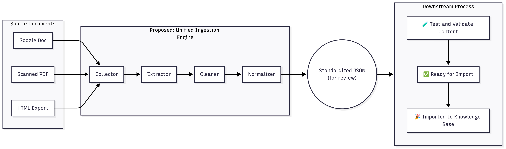

# ADAM Data Ingestion Library

This repository contains the official collection of tools and packages used for the data collection and ingestion pipeline for ADAM, the company's RAG system. The primary goal of this library is to process, standardize, and validate various source documents before they are fed into the Amazon Bedrock knowledge base.

---

### Documentation: 
* <a href="https://goeden-gab.notion.site/Technical-Assets-Tools-21b7c1ad9aee80819e80e485ab6952b0">**<u>Technical Documentation</u>**</a>
* <a href="https://goeden-gab.notion.site/Knowledge-Base-Data-Workflow-SOPs-2097c1ad9aee80fb9d00dfbec84367c5">**<u>Knowledge Base: Data Workflow & SOPs</u>**</a>

> **Note:** README files are included in the existing packages.

---

## 📦 Current Packages

This section describes the initial packages developed for the ingestion pipeline.

### 1. `pdf_text_layer_package`  
**Status:** ACTIVE  

**Purpose:**  
This package was created to address the initial requirement of making image-based PDFs searchable. It extracts text from images within PDF files while attempting to preserve the original document structure.

**Known Limitations:**  
This library currently struggles to maintain the structure of complex tables and layouts. While the text is extracted, its position may be compromised. Without cleaning (which requires the document to lose its original structure), this results to dirty data which is bad idea to feed to the RAG system.

*Example:*  

> **Note:** Because of this, this package will be phased out as transitioning to the more robust Unified Ingestion Engine detailed below. The new workflow will handle PDF processing more effectively.

---

### 2. `quality_control_tools`  
**Status:** ACTIVE  

**Purpose:**  
This package contains the Data Quality Control (QC) Review Tool, a simple, self-contained web application that transforms standardized JSON data schemas into a human-friendly, readable format.

**Functionality:**
- Allows a "QC Operator" to visually inspect documents processed by the automated system.
- Provides a simple interface to **Approve** correct documents or **Reject** incorrect ones with a mandatory rejection reason.
- Designed for potential integration with future automation libraries to streamline the review process.

---

## 🚀 Future Vision: The Unified Ingestion Engine

To create a more scalable, maintainable, and efficient pipeline, we are moving towards a **Unified Ingestion Engine**. This engine will serve as the central hub for processing all incoming documents, regardless of their source format, and converting them into a standardized JSON structure ready for downstream use.

### 📊 Proposed Workflow Diagram

This diagram illustrates how various source documents are funneled into the engine, processed through several stages, and emerge as a standardized JSON file ready for validation and import.

---

## ⚙️ Core Responsibilities of the Engine

The Unified Ingestion Engine will be composed of several distinct components, each with a specific responsibility.

### 1. File Collection (`Collector`)
Acts as the single entry point for all documents entering the pipeline. Responsible for monitoring data sources (e.g., S3 buckets, Google Drive folders) and gathering raw files for processing.

### 2. Intelligent Extraction (`Extractor`)
Analyzes the file type and selects the appropriate tool to extract content. Differentiates between prose, tables, and figures while capturing associated metadata.

### 3. Data Cleaning (`Cleaner`)
Corrects errors and removes digital artifacts introduced during extraction or OCR.

- **Character & Encoding Correction**: Fixes common OCR/encoding errors (e.g., â€TM → ',  → [removed]).
- **Whitespace Management**: Removes excessive whitespace, line breaks, tabs.
- **Artifact Removal**: Removes non-essential elements like page numbers, headers, footers.
- **Basic Data Formatting**: Standardizes formats, e.g., converts `June 10, 2025` → `2025-06-10`.

### 4. Data Normalization (`Normalizer`)
Transforms cleaned data into a standardized JSON schema. Ensures consistency across documents to simplify validation and AI model ingestion.

### 5. Validation & Quality Scoring (`Validator / Scorer`)
Inspects the JSON, scores its quality, and flags it for review if necessary.

- **Schema Adherence**: Ensures strict schema conformance.
- **Confidence Scoring**: Aggregates confidence from Extractor tools.
- **Flagging for Manual QC**: Flags low-quality or invalid documents for human review.
